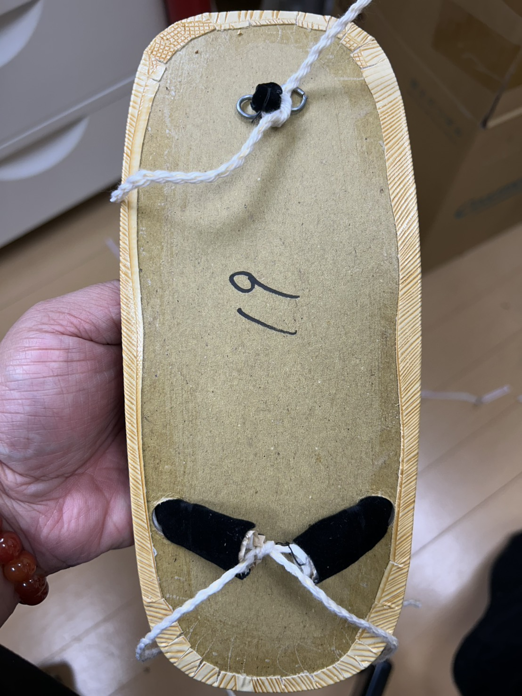
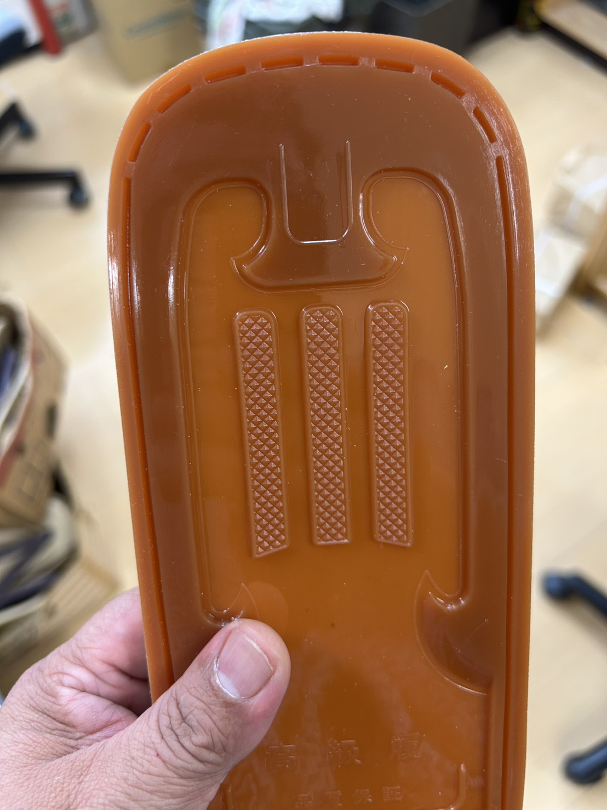
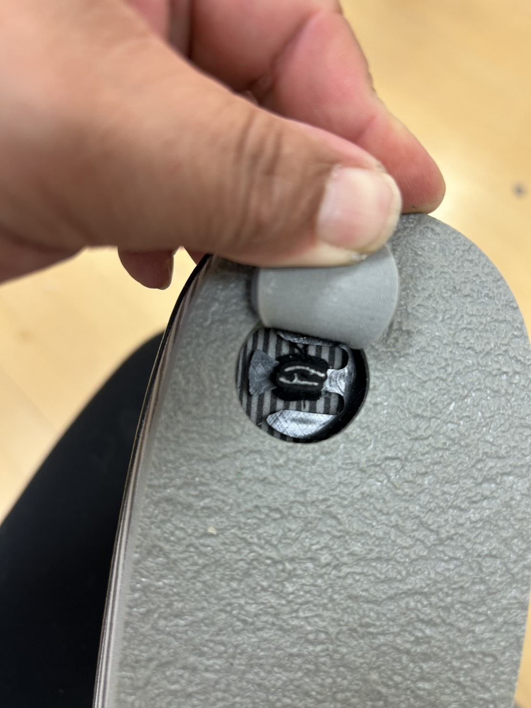
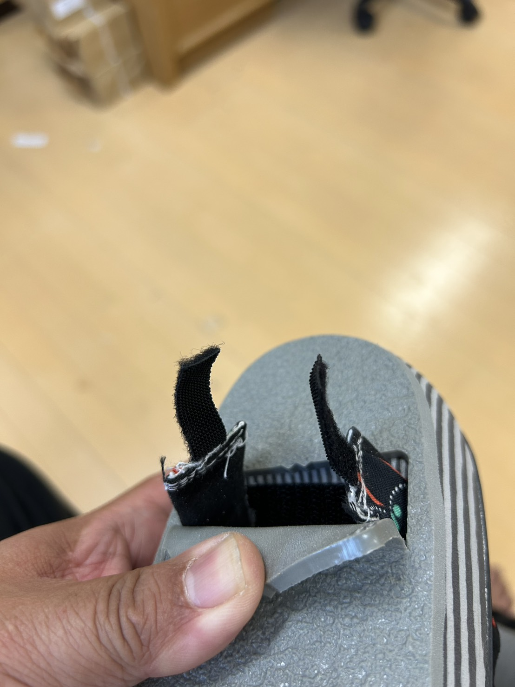

<!-- @import "mpe-wasabiya.css" -->

## 事業計画書
#### （奈良中央信用金庫 グッドサポート用）
#### 事業者概要
**屋号**：わさびや
**業種**：和装履物製造業
**事業内容**：卸売り・小売り・オンラインショップ・店舗販売
**URL**：[https://wasabiya.store](https://wasabiya.store)

---
#### INDEX
下記リンクから各項目へジャンプ出来ます。
[背景](#背景)
[現状課題](#現状課題)
[現状課題の改善策](#現状課題の改善策)
[事業の目的](#事業の目的)
[まとめ](#まとめ)
[日程表](#日程表)
[予算](#予算関連案)

---

#### 背景

当方が営む三郷町の地場産業である従来の軽装履き物 ※図１ は、主に男性向けの「鼻緒を先に挿げておく」（以下、先挿げ）タイプであり、汎用的かつ安価なタイプの雪駄が多い。

一方、呉服店などで扱われる1足5万円以上の高級和装履物は、専属の職人や内製で製造する企業が存在している。

しかしながら、先挿げ方式には以下の課題がある：

- 汎用性を高めるためにきつめに挿げてあるが、履く人によっては痛みを感じる。
- 接着剤で完全に固定されているため、修理が基本的に不可能である。

また、後挿げ方式（出荷後に鼻緒をすげる方法）にも課題がある：

- 出荷先で鼻緒を挿げる職人が必要だが、現在そのような職人を抱える事業者はほとんど存在しない。

---

#### 現状課題

- 現在の事業は **OEM や卸売中心であり、一般消費者への認知度が低い。**
- 消費者と直接接点を持つ販売機会が限られており、実際のニーズや履き心地の声を商品開発に反映しづらい。
- 後挿げができる職人の減少により、修理対応や販売機会の多様化に制約がある。

---

#### 現状課題の改善策

- **株式会社一歩様のパテント技術** ※図3、図4（簡易的な鼻緒挿げ手法）を導入することで、専門技術がなくても誰でも容易に鼻緒を挿げることが可能となった。
- この新手法により、**ハンドメイドマルシェなどの小規模ブース出店でも、来場者の足に合わせてその場で仕上げて即売できる体制** を整えることができる。
- 製造・販売を「半製品（天＋台のみ）」の状態で在庫化できるため、在庫スペースの圧縮や、サイズ・デザイン展開の柔軟化にもつながる。
- 加えて、消費者自身が挿げ体験を通して「自分だけの一足」を作ることができるため、体験価値とブランドへの愛着形成が期待できる。

  
   <em>図1.　従来の雪駄（天）</em>

  
   <em>図2.　従来の雪駄（底）</em>

  
   <em>図3.　株式会社一歩様のパテント技術</em>

  
   <em>図4. パテント技術（後ろ側）</em>

---

#### 事業の目的

1. **全国のハンドメイドマルシェへの出店**
   - 一般消費者への認知度向上
   - 消費者の声を直接聴取し、商品開発に反映
   - 簡単な鼻緒挿げ体験を通じた顧客ロイヤルティの向上

2. **後挿げ職人不足問題の解消**
   - 「誰でも簡単に挿げられる」技術を採用し、従来の職人依存型モデルからの転換を図る
   - 後挿げ文化を一般消費者にも開放することで、履物文化の継承と普及を実現する

3. **環境問題（SDGs）への取り組み**
   - 鼻緒や天（履き面）を交換可能にすることで、破損部分のみの交換が可能となり廃棄を最小化
   - 季節や気分に応じて色柄を自由に変えられる履物として、サステナブルな使用価値を提供する

---

#### まとめ

本事業では、伝統的な「和装履物」の技術と文化を守りながら、
現代の消費者が求める **快適性・体験性・持続可能性** を備えた新しい履物のあり方を提案する。

「わさびや」は、地場産業としての「三郷町の履物文化」を次世代に継承するとともに、
日本全国の消費者へ向けた新しい和装履物ブランドとして発信し、
地域経済の活性化に寄与することを目指す。

---
(全国のハンドメイドマルシェ)[https://handmade-marche.jp/list/] 
(ヨコハマハンドメイドマルシェ)[https://handmade-marche.jp/]　※全国でも最大
[編集用リンク予算へ](#わさびやキャラバン費用ハンドメイドマルシェ全会場出展)
#### 日程表
| イベント名                   | 年   | 月日             | 会場             | 出展料 |　ショップ形態 | 来場者数 (人)    | マーク |
| :--                         | --:  | --:              | --:             | --:    | --:          | --:     | --:   |
| ヨコハマハンドメイドマルシェ秋 | 2025 | 11/1(土)・2(日)  | パシフィコ横浜    | 36,800 | ハンドメイド  | 25000 | 〇    |
| 京都ハンドメイドマルシェ      | 2025 | 12/6(土)・7(日)   | みやこめっせ     | 29,800 | ハンドメイド   | 8500   | U |△    |
| 浜松ハンドメイドマルシェ      | 2026 | 1/17(土)・18(日)  | アクトシティ浜松 | 26,000 | ワークショップ |  9900  | U   |
| 名古屋ハンドメイドマルシェ    | 2026	| 1/31(土)・2/1(日) | 吹上ホール       | 不明   | 未定          |   ?    | U
| 東京ハンドメイドマルシェ春    | 2026	| 4/18(土)・19(日)  | 東京ドームシティ | 23,800 | ワークショップ | 11000 | U  |(どちらか１日のみ出展可) |
| 札幌ハンドメイドマルシェ      | 2026	| 4/25(土)・26(日)  | つどーむ        | 不明   | 未定           |  ?  | U |
| 博多ハンドメイドマルシェ      | 2026	| 5/16(土)・17(日)  | 福岡国際センター | 不明   | 未定           |  8100 |
| ヨコハマハンドメイドマルシェ   | 2026 |	6/20(土)・21(日) | パシフィコ横浜   | 36,800 | ハンドメイド    | 24000 |
| 神戸ハンドメイドマルシェ      | 2026 | 7/18(土)・19(日)  | 神戸国際展示場   | 不明   | 未定           | 7700 |
| 瀬戸内ハンドメイドマルシェ    | 2026	| 8/1(土)・2(日)    | コンベックス岡山 | 不明   | 未定           | 8400 |

〇　キャンセル待ち登録済

△　キャンセル待ち

U　 通常登録未登録

◎　出展決定

×　出展出来ず

---

## 予算関連（案）
[別表 費用（案）]("~/Shibachan1015/wasabiya/jigyoukeikaku/asset/わさびやキャラバン費用.pdf")

#### わさびやキャラバン費用（ハンドメイドマルシェ全会場出展）

#### 前提条件
- 車種：スズキ・キャリイ（軽自動車）
- ガソリン：全国平均 171.3円/L（2025/10/13時点）、燃費14km/L → 燃料費 約12.24円/km
- 高速代：NEXCO基準 普通車24.6円/km × 軽係数0.8 → 19.68円/km
- 宿泊費：1泊あたり 30,000円（場所によってはかなり高いところもあるので、３万円で計上）
- 札幌はフェリー（舞鶴〜小樽）往復91,200円を加算

### わさびやキャラバン費用（ハンドメイドマルシェ全会場出展）

| 開催地/日                 | 会場             | 往復距離(km) | 高速代 | ガソリン代 | 駐車場 | ブース料(ショート) | ブース料(スクエア) | ブース料(ワークショップ) | 宿泊費 | フェリー(往復) | 合計(ショート・1泊) |
|:--|:--|--:|--:|--:|--:|--:|--:|--:|--:|--:|--:|
| 静岡（2026）              | ツインメッセ静岡   | 660         | 12,989  | 8,076  | 1,000  | 9,800           | 14,800         | ???? | 30,000 | – | **76,665** |
| 横浜(秋)（2025-11-01/02） | パシフィコ横浜     | 980         | 20,286  | 11,991 | 1,800  | 13,800          | 36,800        | ???? | 30,000 | – | **98,677** |
| 京都（2025-12-06/07）     | みやこめっせ      | 120         | 2,362   | 1,468   | 1,500 | 11,800          | 29,800         | ???? | 30,000 | – | **65,930** |
| 金沢（2026）              | 石川県産業展示館   | 640         | 12,595  | 7,831   | 0     | 9,800          | 14,800          | ???? | 30,000 | – | **75,026** |
| 浜松（2026-01-17/18）     | アクトシティ浜松   | 520         | 10,234  | 6,363   | 1,500 | 10,800          | 15,800          | 26,000 | 30,000 | – | **74,697** |
| 名古屋（2026-01-31/02-01） | 吹上ホール        | 300         | 5,904  | 3,671    | 1,600 | 10,800         | 16,800          | ???? | 30,000 | – | **68,775** |
| 東京(春)（2026-04-18/19）  | 東京ドームシティ   | 1,040       | 21,467 | 12,725   | 2,200 | 15,800         | 23800              | ???? | 30,000 | – | **82,192** |
| 札幌（2026-04-25/26）      | つどーむ         | 380         | 7,478   | 4,650   | 800    | 8,800         | 10,800          | ???? | 30,000 | 91,200 | **153,728** |
| 博多（2026-05-16/17）      | 福岡国際センター  | 1,200       | 23,616  | 14,683   | 1,000 | 11,800         | 18,800         | ???? | 30,000 | – | **99,899** |
| 横浜(夏)（2026-06-20/21）  | パシフィコ横浜    | 980         | 20,286  | 11,991   | 1,800 | 13,800         | 36,800          |  ???? | 30,000 | – | **98,677** |
| 瀬戸内（2026-08-01/02）    | コンベックス岡山   | 420         | 8,266  | 5,139     | 0     | 9,800         | 14,800         | ???? | 30,000 | – | **68,005** |

---
[編集用リンク日程表へ](#日程表)

## 総合計

| 区分                    | 高速代    | ガソリン代 | 駐車場  | ブース料(ショート) | ブース料(スクエア) | ブース料(ワークショップ) | 宿泊費合計 | フェリー | **総合計** |
|:--|--:|--:|--:|--:|--:|--:|--:|--:|--:|
| **最小（ブース小計min）**  | 148,829 | 90,668    | 14,400 | 138,600         | –               | ????                 | 360,000  | 91,200  | **843,697（参考）** |
| **最大（ブース小計max）**  | 148,829 | 90,668    | 14,400 | –               | 185,800         | ????                 | 360,000  | 91,200  | **890,897（参考）** |

---

## 備考
- ワークショップブースの料金は現在未確定のため、`????` としています。
---

## 計算方法メモ
- **基準の日にち** : 2025年10月１6日現在の価格を参照
- **燃費計算**：ガソリン全国平均 171.3円/L、燃費14km/L → 約12.24円/km
- **高速代計算**：NEXCO基準 普通車24.6円/km × 軽係数0.8 → 19.68円/km

---
© わさびや

[INDEXへ](#index)
[Topへ](#事業計画書)

